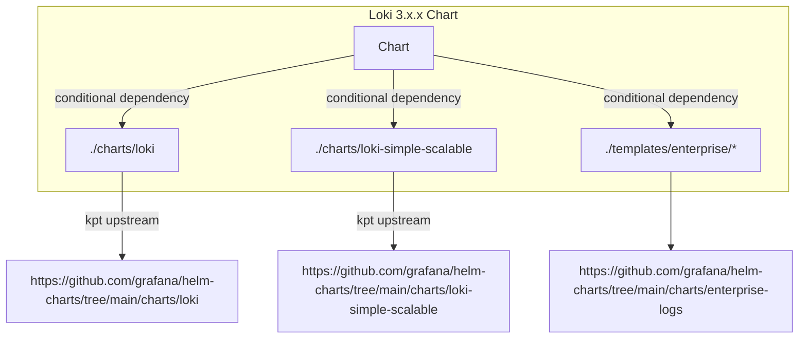
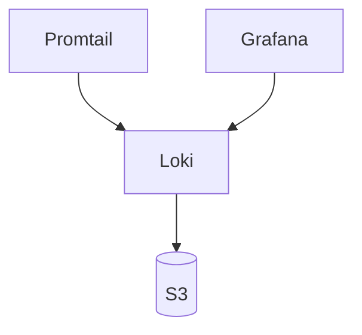
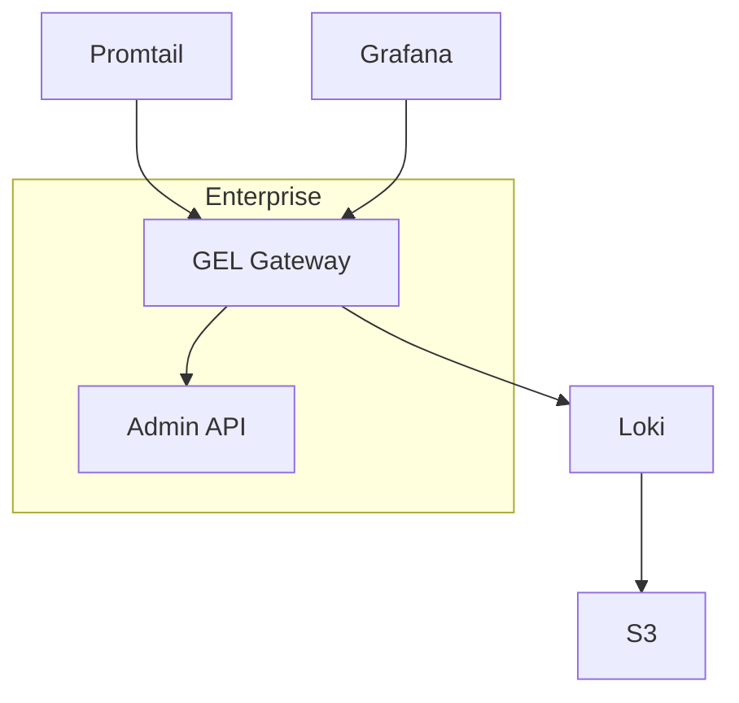
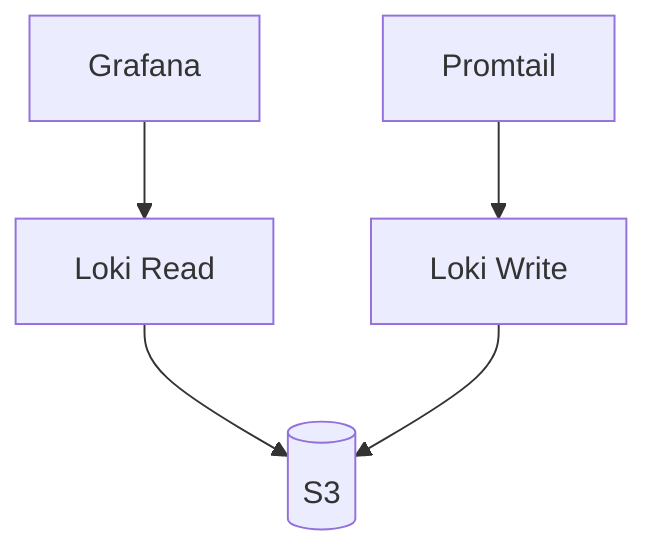
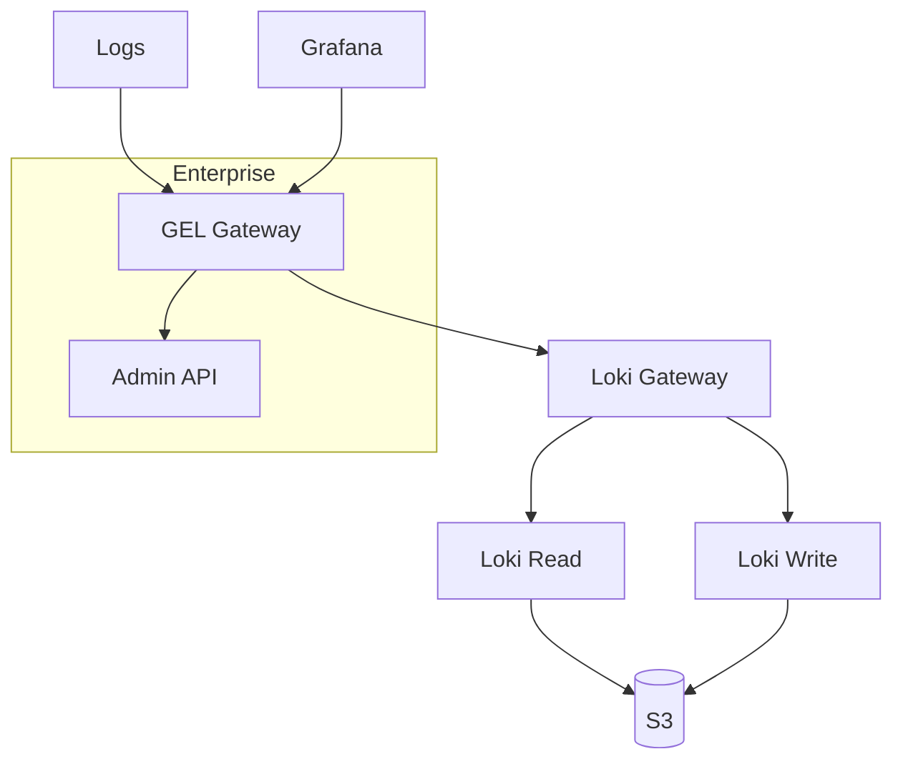

# Motivations for Restructure
The original Loki BigBang chart referenced [Grafana's Loki monolith chart](https://github.com/grafana/helm-charts/tree/main/charts/loki) as its upstream source. It was restructured to support two main goals.   
* Support Loki's [multiple architectures](https://grafana.com/docs/loki/latest/fundamentals/architecture/) with a consistent interface for chart consumers
* Support [Grafana Enterprise Logs](https://grafana.com/docs/enterprise-logs/latest/), Grafana's enterprise functionality as an optional additional component

# Migrating from 2.x.x 
Previous values passed into `values.yaml` should be nested under `loki:` which should remain consistent with the previous top level values. 

The main caveat to that is the previous implementation included `.Values.config.existingSecret` which allowed you to use a specified secret for a config. This value has been replaced with `.Values.global.existingSecretForConfig` which behaves the same way but was relocated to provide an option that was consistent for all architecture modes.    

Previous `values.yaml`
```
replicas: 3
extraArgs:
  # https://github.com/grafana/loki/issues/5021
  target: all,table-manager
config:
  auth_enabled: false
  ingester:
    chunk_target_size: 196608
    lifecycler:
      ring:
        kvstore:
          store: inmemory
        replication_factor: 1
...
```
Updated `values.yaml`
```
loki:
  replicas: 3
  extraArgs:
    # https://github.com/grafana/loki/issues/5021
    target: all,table-manager
  config:
    auth_enabled: false
    ingester:
      chunk_target_size: 196608
      lifecycler:
        ring:
          kvstore:
            store: inmemory
          replication_factor: 1
...
```
# Using Simple Scalable Architecture
To opt for the simple scalable architecture enable `loki-simple-scalable` and disable `loki`

See [Configuration](#loki-config-options) for options building the Loki config for the simple-scalable architecture

```
loki-simple-scalable:
  enabled: true

loki:
  enabled: false
```

# Loki Config Options
To specify a config file for Loki you can either:
* Leverage the respective `config` object in either the `loki` and `loki-simple-scalable` subchart depending on which architecture you choose.
*  Specify a secret to use with `global.existingSecretForConfig`
* Use the secret generated in the parent chart, by setting `.Values.global.createGlobalConfig: true` and  `.Values.global.existingSecretForConfig: loki-config`

### Loki
`.Values.loki.config`
### Loki Simple Scalable
`.Values.loki-simple-scalable.loki.config`
### Existing Secret
`.Values.global.existingSecretForConfig`

# Refactored Structure (3.x.x) 
The updated design includes the additional upstream of [simple-scalable](https://github.com/grafana/helm-charts/tree/main/charts/loki-simple-scalable) chart, as well as components from the [enterprise logs](https://github.com/grafana/helm-charts/tree/main/charts/enterprise-logs) chart.

The previous chart implementation (`Loki 2.x.x-bb.x`), referenced the [loki monolith](https://github.com/grafana/helm-charts/tree/main/charts/loki) chart exclusively as its upstream. 


## Monolith



## Monolith with Grafana Enterprise Logging (GEL)


## Simple Scalable


## Simple Scalable Enterprise with Grafana Enterprise Logging (GEL)



  
